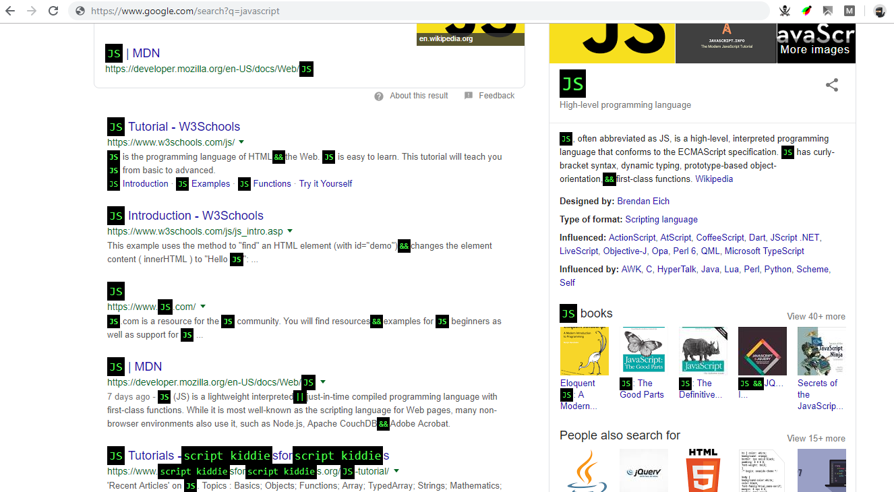

# chrome-extension
It changes text in webpage into some other text e.g.
```js
- home       -->  '127.0.0.1'
- and        -->  &&
- or         -->  ||
- password   -->  xxxxxxxx
- ok         --> 200
- not        --> !
- true       --> while(1)
- false      --> 0
- equal      --> ==
- Google     --> G-root
- javascript --> JS
- geek       -->  script kiddie
```

